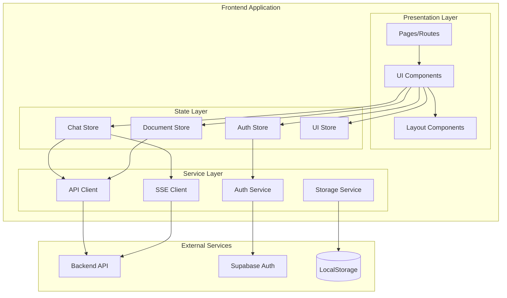

# Design Document: Frontend Redesign

## Overview

本设计文档描述了 Agentic RAG 系统前端的架构设计。前端采用 React + TypeScript 技术栈，使用 Vite 作为构建工具，Zustand 作为状态管理，TailwindCSS 作为样式方案。核心特性包括：

- **Agent 工作台**: 双屏布局，左侧对话、右侧证据看板
- **流式响应**: 基于 SSE 的实时思考过程展示
- **引用溯源**: 可点击的引用徽章，跳转到原文高亮
- **响应式设计**: 桌面/平板/移动端自适应

## Architecture



## Components and Interfaces

### 1. 页面结构

```
/                     -> 重定向到 /chat 或 /login
/login                -> 登录页面
/chat                 -> Agent 对话工作台 (主页面)
/chat/:sessionId      -> 特定会话
/documents            -> 文档管理页面
/subscription         -> 订阅管理页面
/settings             -> 用户设置页面
```

### 2. 核心组件

#### ChatWorkbench (Agent 工作台)
```typescript
interface ChatWorkbenchProps {
  sessionId?: string;
}

// 双屏布局: 左侧对话 + 右侧证据看板
// 移动端: 底部 Tab 切换
```

#### MessageBubble (消息气泡)
```typescript
interface MessageBubbleProps {
  message: ChatMessage;
  onCitationClick: (citation: Citation) => void;
  onFeedback: (type: 'up' | 'down') => void;
}
```

#### ThoughtProcess (思考过程折叠组件)
```typescript
interface ThoughtProcessProps {
  steps: ThoughtStep[];
  isExpanded: boolean;
  onToggle: () => void;
}
```

#### EvidenceBoard (证据看板)
```typescript
interface EvidenceBoardProps {
  citation: Citation | null;
  onClose: () => void;
}
```

#### CitationBadge (引用徽章)
```typescript
interface CitationBadgeProps {
  index: number;
  citation: Citation;
  onClick: () => void;
}
```

#### StatusIndicator (意图状态指示器)
```typescript
interface StatusIndicatorProps {
  status: AgentStatus;
  toolName?: string;
}

type AgentStatus = 'idle' | 'thinking' | 'searching_docs' | 'searching_web' | 'analyzing' | 'generating';
```

### 3. 服务接口

#### SSE Client
```typescript
interface SSEClientOptions {
  onThinking: (content: string) => void;
  onToolCall: (tool: string, input: any) => void;
  onToolResult: (result: any) => void;
  onAnswer: (answer: string, sources: Source[]) => void;
  onError: (error: string) => void;
  onDone: () => void;
}

class SSEClient {
  connect(url: string, body: object, options: SSEClientOptions): void;
  abort(): void;
}
```

#### Storage Service
```typescript
interface StorageService {
  saveConversations(conversations: Conversation[]): void;
  loadConversations(): Conversation[];
  saveTheme(theme: 'light' | 'dark'): void;
  loadTheme(): 'light' | 'dark';
}
```

## Data Models

### Chat Models
```typescript
interface Conversation {
  id: string;
  title: string;
  documentIds: string[];
  messages: ChatMessage[];
  createdAt: string;
  updatedAt: string;
}

interface ChatMessage {
  id: string;
  role: 'user' | 'assistant';
  content: string;
  citations?: Citation[];
  thoughtSteps?: ThoughtStep[];
  feedback?: 'up' | 'down' | null;
  timestamp: string;
}

interface Citation {
  index: number;
  documentId: string;
  chunkId: string;
  page?: number;
  text: string;
  textSnippet: string;           // 用于全文搜索匹配高亮
  highlightCoords?: number[][];  // PDF 高亮坐标 (quadrilaterals)
  sourceType: 'pdf' | 'web';
  url?: string;
}

interface ThoughtStep {
  thought: string;
  action: string;
  actionInput: any;
  observation: string;
}
```

### Document Models
```typescript
interface Document {
  id: string;
  name: string;
  status: 'pending' | 'processing' | 'ready' | 'failed';
  errorMessage?: string;
  createdAt: string;
  pageCount?: number;
}
```

### Auth Models
```typescript
interface User {
  id: string;
  email: string;
  name?: string;
  avatarUrl?: string;
}

interface AuthState {
  user: User | null;
  accessToken: string | null;
  isAuthenticated: boolean;
  isLoading: boolean;
}
```

### Subscription Models
```typescript
interface Subscription {
  plan: 'free' | 'pro' | 'enterprise';
  features: string[];
  remainingCredits: number;
  totalCredits: number;
}
```

## Correctness Properties

*A property is a characteristic or behavior that should hold true across all valid executions of a system-essentially, a formal statement about what the system should do. Properties serve as the bridge between human-readable specifications and machine-verifiable correctness guarantees.*

Based on the prework analysis, the following properties can be verified through property-based testing:

### Property 1: Authentication state consistency
*For any* authentication action (login success, logout), the auth state should transition correctly: login sets user and token, logout clears both.
**Validates: Requirements 1.3, 1.4**

### Property 2: Document list rendering completeness
*For any* list of documents, the rendered output should contain the name, status, and upload date for each document.
**Validates: Requirements 2.3**

### Property 3: Error message display
*For any* error response from the API, the UI should display an error message containing the error details.
**Validates: Requirements 2.6, 3.7, 5.3**

### Property 4: SSE event rendering
*For any* valid SSE event (thinking, tool_call, tool_result, answer), the correct component type should be rendered.
**Validates: Requirements 3.2, 3.3**

### Property 5: Citation parsing and rendering
*For any* answer string containing citation markers [[citation:doc_id:chunk_id]], the output should contain clickable badges with correct indices.
**Validates: Requirements 3.5**

### Property 6: Markdown rendering
*For any* markdown string containing tables, code blocks, or LaTeX, the rendered output should contain the corresponding HTML elements.
**Validates: Requirements 3.6**

### Property 7: Agent response feedback buttons
*For any* agent response message, the rendered output should include both thumbs up and thumbs down buttons.
**Validates: Requirements 3.9**

### Property 8: Subscription display completeness
*For any* subscription data, the rendered output should contain plan name, features list, and remaining credits.
**Validates: Requirements 4.1**

### Property 9: Loading state indicator
*For any* loading state, the UI should display either a skeleton loader or spinner.
**Validates: Requirements 5.2**

### Property 10: Theme switching
*For any* theme value ('light' or 'dark'), setting the theme should update the UI accordingly and persist the preference.
**Validates: Requirements 5.4**

### Property 11: Conversation persistence round-trip
*For any* conversation object, serializing to localStorage and deserializing should produce an equivalent object.
**Validates: Requirements 6.4, 7.2, 7.3**

### Property 12: Message append preserves history
*For any* conversation with existing messages, appending a new message should preserve all previous messages and add the new one.
**Validates: Requirements 6.3**

### Property 13: Citation click actions
*For any* citation click, the system should trigger: (1) document load for the correct documentId, (2) scroll to the correct page, (3) highlight the correct chunk.
**Validates: Requirements 8.2, 8.3, 8.4**

### Property 14: Source type component selection
*For any* citation, if sourceType is 'pdf' then PDF viewer is used, if sourceType is 'web' then card component is used.
**Validates: Requirements 8.5, 8.6**

### Property 15: Intent status indicator mapping
*For any* intent type from the router, the correct status indicator text and icon should be displayed.
**Validates: Requirements 9.1, 9.2, 9.3**

## Error Handling

### API Errors
- **401 Unauthorized**: Redirect to login, clear auth state
- **402 Payment Required**: Show credits insufficient modal with upgrade options
- **404 Not Found**: Show "Document not found" message
- **500 Server Error**: Show toast with error details, offer retry

### SSE Errors
- **Connection Lost**: Auto-reconnect with exponential backoff (max 3 attempts)
- **Stream Error**: Display error message, enable retry button
- **Timeout**: Show timeout message after 60 seconds

### Validation Errors
- **Empty Question**: Disable send button, show hint
- **Invalid File Type**: Show "Only PDF files are supported" message
- **File Too Large**: Show size limit message (max 50MB)

## Testing Strategy

### Property-Based Testing (Hypothesis for Python-like, fast-check for TypeScript)

We will use **fast-check** as the property-based testing library for TypeScript/React.

Each property-based test MUST:
1. Run a minimum of 100 iterations
2. Be tagged with a comment referencing the correctness property: `**Feature: frontend-redesign, Property {number}: {property_text}**`
3. Use smart generators that constrain to valid input space

### Unit Tests
- Component rendering tests with React Testing Library
- Hook behavior tests
- Utility function tests (citation parser, markdown renderer)

### Integration Tests
- Auth flow with mocked Supabase
- SSE streaming with mocked EventSource
- LocalStorage persistence

### Test File Structure
```
frontend/
├── src/
│   ├── components/
│   │   └── __tests__/
│   ├── stores/
│   │   └── __tests__/
│   ├── services/
│   │   └── __tests__/
│   └── utils/
│       └── __tests__/
└── tests/
    ├── properties/          # Property-based tests
    │   ├── auth.property.test.ts
    │   ├── chat.property.test.ts
    │   ├── citation.property.test.ts
    │   └── storage.property.test.ts
    └── integration/         # Integration tests
```
