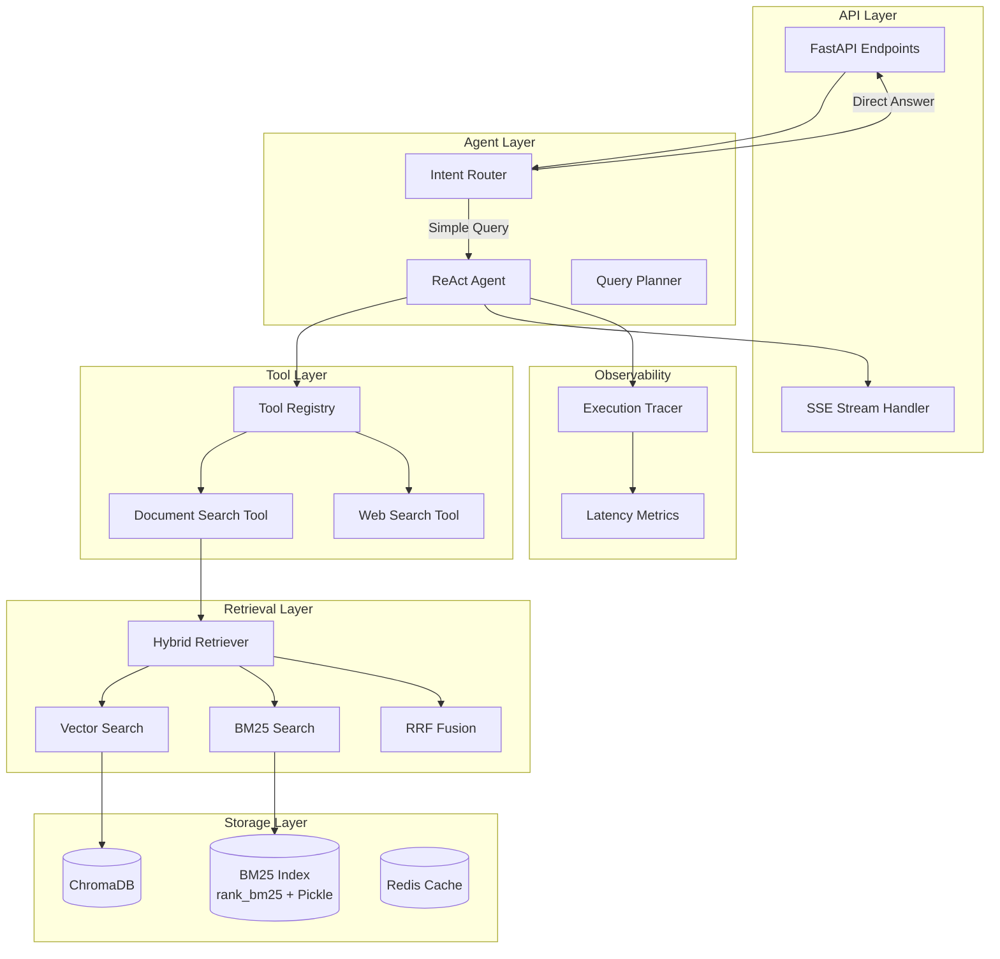

# Design Document: Generic Agentic RAG System

## Overview

本设计文档描述将现有区块链白皮书分析系统改造为通用 Agentic RAG 系统的技术方案。核心改动包括：

1. 移除 `analysis_workflow.py` 中的区块链特定逻辑
2. 引入 Agent 架构，支持工具调用和多步推理
3. 实现混合检索（向量 + BM25 + RRF 融合）
4. 添加 Router 意图识别机制
5. 支持流式输出和可观测性

## Architecture



## Components and Interfaces

### 1. Intent Router (意图路由器)

负责分类用户意图，决定处理路径。

```python
from enum import Enum
from typing import Protocol
from pydantic import BaseModel

class IntentType(Enum):
    DIRECT_ANSWER = "direct_answer"      # 简单问候、闲聊
    DOCUMENT_QA = "document_qa"          # 需要检索文档
    WEB_SEARCH = "web_search"            # 需要联网搜索
    COMPLEX_REASONING = "complex"        # 需要多步推理

class IntentClassification(BaseModel):
    intent: IntentType
    confidence: float
    reasoning: str

class IntentRouter(Protocol):
    def classify(self, query: str, context: dict) -> IntentClassification:
        """Classify user intent to determine processing path.
        
        Fallback mechanism: If DIRECT_ANSWER confidence < 0.8,
        automatically escalate to DOCUMENT_QA to avoid false negatives.
        """
        ...
```

### 2. Tool Registry (工具注册表)

管理 Agent 可调用的工具。

```python
from typing import Any, Callable, Dict, List, Optional
from pydantic import BaseModel

class ToolSchema(BaseModel):
    name: str
    description: str
    parameters: Dict[str, Any]  # JSON Schema
    required: List[str] = []

class Tool(BaseModel):
    schema: ToolSchema
    handler: Callable[..., Any]
    
class ToolRegistry:
    def __init__(self):
        self._tools: Dict[str, Tool] = {}
    
    def register(self, tool: Tool) -> None:
        """Register a tool with the registry."""
        self._tools[tool.schema.name] = tool
    
    def get(self, name: str) -> Optional[Tool]:
        """Get a tool by name."""
        return self._tools.get(name)
    
    def list_tools(self) -> List[ToolSchema]:
        """List all registered tool schemas."""
        return [t.schema for t in self._tools.values()]
    
    def invoke(self, name: str, **kwargs) -> Any:
        """Invoke a tool by name with given parameters."""
        tool = self._tools.get(name)
        if not tool:
            raise ValueError(f"Tool not found: {name}")
        return tool.handler(**kwargs)
```

### 3. Hybrid Retriever (混合检索器)

结合向量检索和 BM25 关键词检索。

```python
from typing import List, Dict, Optional
from dataclasses import dataclass

@dataclass
class RetrievalResult:
    chunk_id: str
    text: str
    metadata: Dict[str, Any]
    vector_score: Optional[float] = None
    bm25_score: Optional[float] = None
    fused_score: float = 0.0

class HybridRetriever:
    def __init__(
        self,
        vector_weight: float = 0.7,
        bm25_weight: float = 0.3,
        rrf_k: int = 60,
    ):
        self.vector_weight = vector_weight
        self.bm25_weight = bm25_weight
        self.rrf_k = rrf_k
    
    def search(
        self,
        query: str,
        document_id: str,
        user_id: str,
        k: int = 10,
    ) -> List[RetrievalResult]:
        """Perform hybrid search combining vector and BM25."""
        ...
    
    def _rrf_fusion(
        self,
        vector_results: List[RetrievalResult],
        bm25_results: List[RetrievalResult],
    ) -> List[RetrievalResult]:
        """Apply Reciprocal Rank Fusion to combine results."""
        ...
```

### 4. ReAct Agent (推理-行动 Agent)

实现 ReAct 模式的 Agent，支持多步推理。

```python
from typing import AsyncIterator, List, Optional
from pydantic import BaseModel

class ThoughtStep(BaseModel):
    thought: str
    action: Optional[str] = None
    action_input: Optional[Dict[str, Any]] = None
    observation: Optional[str] = None

class AgentResponse(BaseModel):
    answer: str
    sources: List[Dict[str, Any]]
    intermediate_steps: List[ThoughtStep]
    model_used: str
    total_latency_ms: float

class AgentStreamEvent(BaseModel):
    event_type: str  # "thinking", "tool_call", "tool_result", "answer"
    content: str
    metadata: Optional[Dict[str, Any]] = None

class ReActAgent:
    def __init__(
        self,
        tool_registry: ToolRegistry,
        router: IntentRouter,
        max_steps: int = 10,
    ):
        self.tools = tool_registry
        self.router = router
        self.max_steps = max_steps
    
    async def run(
        self,
        query: str,
        document_id: str,
        user_id: str,
        stream: bool = False,
    ) -> AgentResponse:
        """Execute agent reasoning loop."""
        ...
    
    async def stream(
        self,
        query: str,
        document_id: str,
        user_id: str,
    ) -> AsyncIterator[AgentStreamEvent]:
        """Stream agent execution events."""
        ...
```

### 5. Execution Tracer (执行追踪器)

记录 Agent 执行过程，支持 LangSmith/LangFuse 格式。

```python
from typing import Any, Dict, List, Optional
from datetime import datetime
from pydantic import BaseModel

class TraceSpan(BaseModel):
    span_id: str
    parent_id: Optional[str]
    name: str
    start_time: datetime
    end_time: Optional[datetime]
    inputs: Dict[str, Any]
    outputs: Optional[Dict[str, Any]]
    metadata: Dict[str, Any] = {}
    latency_ms: Optional[float] = None

class ExecutionTrace(BaseModel):
    trace_id: str
    spans: List[TraceSpan]
    total_latency_ms: float

class ExecutionTracer:
    def start_span(self, name: str, inputs: Dict[str, Any]) -> str:
        """Start a new trace span, returns span_id."""
        ...
    
    def end_span(self, span_id: str, outputs: Dict[str, Any]) -> None:
        """End a trace span with outputs."""
        ...
    
    def get_trace(self) -> ExecutionTrace:
        """Get the complete execution trace."""
        ...
    
    def export_langsmith(self) -> Dict[str, Any]:
        """Export trace in LangSmith compatible format."""
        ...
```

## Data Models

### BM25 Index Entry

```python
@dataclass
class BM25IndexEntry:
    document_id: str
    user_id: str
    chunk_id: str
    tokens: List[str]
    term_frequencies: Dict[str, int]
    chunk_length: int
```

### BM25 Index Storage Strategy

**MVP 阶段**: 使用 `rank_bm25` 库 + Pickle 序列化存储到本地文件系统。

```python
# Storage path: backend/app/storage/bm25_indexes/{document_id}.pkl
class BM25IndexStore:
    def save(self, document_id: str, index: BM25Okapi) -> None:
        """Serialize BM25 index to disk using Pickle."""
        ...
    
    def load(self, document_id: str) -> Optional[BM25Okapi]:
        """Load BM25 index from disk."""
        ...
```

**扩展性考虑**: 
- 单实例部署：本地文件存储足够
- 多实例部署：迁移至 Elasticsearch 或 Redis Search
- 索引更新：文档重新处理时重建索引

### Agent Configuration

```python
class AgentConfig(BaseModel):
    max_steps: int = 10
    temperature: float = 0.3
    model: str = "gpt-4o-mini"
    streaming_enabled: bool = True
    trace_enabled: bool = False
    vector_weight: float = 0.7
    bm25_weight: float = 0.3
```

### Analysis Template (可扩展分析模板)

```python
class AnalysisTemplate(BaseModel):
    name: str
    description: str
    dimensions: List[str]
    prompts: Dict[str, str]
    output_schema: Dict[str, Any]
```


## Correctness Properties

*A property is a characteristic or behavior that should hold true across all valid executions of a system-essentially, a formal statement about what the system should do. Properties serve as the bridge between human-readable specifications and machine-verifiable correctness guarantees.*

Based on the prework analysis, the following correctness properties have been identified:

### Property 1: Stream Initiation Latency

*For any* valid user query, the system SHALL emit the first stream event within 3 seconds of receiving the request.

**Validates: Requirements 1.1**

### Property 2: Bilingual Query Support

*For any* question in Chinese or English, the system SHALL produce a valid response without language-specific errors.

**Validates: Requirements 1.4**

### Property 3: Tool Registry Round-Trip

*For any* valid tool definition with name, description, and parameter schema, registering the tool and then retrieving it by name SHALL return an equivalent tool definition.

**Validates: Requirements 2.1**

### Property 4: Tool Result Incorporation

*For any* agent execution that invokes a tool, the tool's result SHALL appear in the agent's intermediate_steps or final answer.

**Validates: Requirements 2.2**

### Property 5: Tool Failure Resilience

*For any* tool invocation that raises an exception, the agent SHALL continue execution and produce a response rather than propagating the exception.

**Validates: Requirements 2.4**

### Property 6: Router Small-Talk Bypass

*For any* small-talk or greeting query (e.g., "你好", "hello", "how are you"), the Router SHALL classify it as DIRECT_ANSWER and no document/web search tools SHALL be invoked.

**Validates: Requirements 2.6**

### Property 7: Complex Query Decomposition

*For any* complex multi-part question, the agent SHALL produce at least 2 intermediate reasoning steps before the final answer.

**Validates: Requirements 3.1**

### Property 8: State Preservation Across Steps

*For any* multi-step agent execution, information gathered in earlier steps SHALL be accessible in later steps (verified by checking that later steps can reference earlier observations).

**Validates: Requirements 3.2**

### Property 9: Step Limit Invariant

*For any* agent execution, the number of reasoning steps SHALL NOT exceed 10.

**Validates: Requirements 3.3**

### Property 10: Final Answer Synthesis

*For any* multi-step agent execution that completes successfully, the response SHALL contain a non-empty final answer.

**Validates: Requirements 3.4**

### Property 11: Configurable Prompts

*For any* prompt template configuration, the system SHALL use the configured template text in LLM calls rather than hardcoded defaults.

**Validates: Requirements 4.3**

### Property 12: Backward Compatibility

*For any* query that worked with the old RAGService.query() method, the same query SHALL produce a valid response after refactoring.

**Validates: Requirements 4.4**

### Property 13: Analysis Template Lifecycle

*For any* valid AnalysisTemplate, registering it SHALL make it retrievable by name, and the retrieved template SHALL be equivalent to the original.

**Validates: Requirements 5.1, 5.2**

### Property 14: Template Serialization Round-Trip

*For any* valid AnalysisTemplate, serializing to JSON/YAML and deserializing SHALL produce an equivalent template.

**Validates: Requirements 5.3**

### Property 15: Hybrid Search Fusion

*For any* search query against a document with indexed content, the hybrid search results SHALL contain items from both vector search and BM25 search (when both return results), and the fused scores SHALL follow the RRF formula.

**Validates: Requirements 6.1, 6.2, 6.3**

### Property 16: Search Weight Configuration

*For any* two different weight configurations (vector_weight, bm25_weight), the same query SHALL produce different result rankings when the underlying scores differ.

**Validates: Requirements 6.4**

### Property 17: API Schema Compatibility

*For any* request to /api/qa/query with the existing schema (document_id, question, model), the response SHALL contain the same fields (answer, sources, model_used) as before refactoring.

**Validates: Requirements 7.1**

### Property 18: Deprecation Header

*For any* request to a deprecated endpoint, the response SHALL include a "X-Deprecation-Warning" header.

**Validates: Requirements 7.3**

### Property 19: Trace Format Compliance

*For any* agent execution with tracing enabled, the exported trace SHALL conform to LangSmith/LangFuse schema (containing trace_id, spans with start_time, end_time, inputs, outputs).

**Validates: Requirements 8.1**

### Property 20: Intermediate Steps Inclusion

*For any* API request with trace=true parameter, the response SHALL include an intermediate_steps field containing the agent's reasoning steps.

**Validates: Requirements 8.2**

### Property 21: Latency Metrics Recording

*For any* agent execution, each tool invocation and reasoning step SHALL have a recorded latency_ms value greater than 0.

**Validates: Requirements 8.3**

## Error Handling

### Agent Errors

| Error Type | Handling Strategy |
|------------|-------------------|
| Tool invocation failure | Log error, continue with available information, include error in trace |
| LLM API timeout | Retry up to 2 times with exponential backoff, then return partial result |
| Step limit exceeded | Stop execution, return best available answer, log full trace |
| Invalid tool parameters | Skip tool call, log warning, continue reasoning |
| Router classification failure | Default to DOCUMENT_QA intent |
| Router low confidence (< 0.8) | Escalate DIRECT_ANSWER to DOCUMENT_QA to avoid false negatives |

### Retrieval Errors

| Error Type | Handling Strategy |
|------------|-------------------|
| ChromaDB connection failure | Return cached results if available, else return error |
| BM25 index not found | Fall back to vector-only search |
| Empty search results | Return "information not found" response |
| Embedding API failure | Retry once, then return error |

### Streaming Errors

| Error Type | Handling Strategy |
|------------|-------------------|
| Client disconnect | Stop generation, cleanup resources |
| Stream timeout | Send heartbeat events every 10s to keep connection alive |
| Partial response | Ensure final event is always sent with complete status |

## Testing Strategy

### Property-Based Testing Framework

The system will use **Hypothesis** (Python) for property-based testing, configured to run a minimum of 100 iterations per property.

### Unit Tests

Unit tests will cover:
- Tool registration and invocation
- Router intent classification with specific examples
- RRF score calculation
- Trace span creation and export
- API request/response serialization

### Property-Based Tests

Each correctness property will have a corresponding property-based test:

```python
from hypothesis import given, strategies as st, settings

# Example: Property 9 - Step Limit Invariant
@settings(max_examples=100)
@given(query=st.text(min_size=1, max_size=500))
def test_step_limit_invariant(query: str):
    """
    **Feature: generic-agentic-rag, Property 9: Step Limit Invariant**
    For any agent execution, steps SHALL NOT exceed 10.
    """
    agent = create_test_agent(max_steps=10)
    result = agent.run(query, document_id="test", user_id="test")
    assert len(result.intermediate_steps) <= 10
```

### Test Annotation Format

All property-based tests MUST include a docstring with:
- `**Feature: {feature_name}, Property {number}: {property_text}**`

### Integration Tests

Integration tests will verify:
- End-to-end agent execution with real LLM calls (mocked in CI)
- Hybrid retrieval against test documents
- API endpoint behavior with authentication
- Streaming response delivery

### Test Data Generators

Custom Hypothesis strategies for:
- Valid queries (Chinese and English)
- Tool definitions with various parameter schemas
- AnalysisTemplate configurations
- Search result sets for RRF testing
